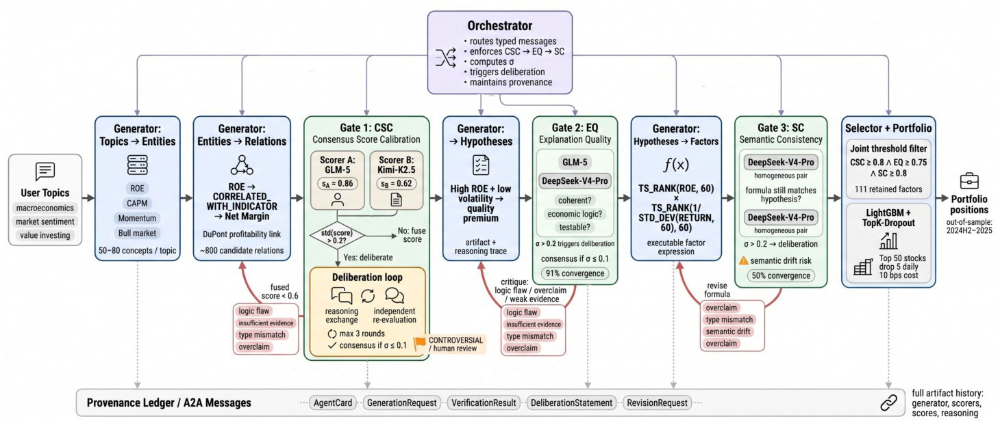

# KG-AgentQuant

<div align="center">

**Knowledge Graph Enhanced Alpha Factor Research with Multi-Agent Verification**

*A multi-stage pipeline for discovering and validating quantitative alpha factors using Large Language Models with stage-wise deliberative consensus.*

[中文文档](README_zh.md)
[](https://opensource.org/licenses/MIT)
[](https://www.python.org/downloads/)
[](#)
[](#)

</div>

---

## Overview

KG-AgentQuant implements a **multi-agent verification architecture** for LLM-driven factor discovery pipelines. When independent scorer LLMs disagree on artifact quality, rather than simple score averaging (which we show degrades accuracy in 55% of disagreement cases), they engage in a **deliberative consensus protocol** — structured multi-turn debate with reasoning exchange.

### Key Innovation

**Stage-wise verification with deliberative consensus.** Three verification gates (CSC, EQ, SC) each employ **dual independent scorer agents**. When scorers disagree (σ > 0.2), they deliberate rather than vote:

| Gate | Checks | Scorer Pair | Convergence |
|------|--------|-------------|-------------|
| **CSC** | Relation credibility | GLM-5 + Kimi-K2.5 | 93% |
| **EQ** | Hypothesis coherence | GLM-5 + DeepSeek-V4-Pro | 91% |
| **SC** | Factor-to-hypothesis fidelity | DeepSeek-V4-Pro × 2 | 50% |

### Architecture

<p align="center">
  
</p>

```
Topics → Entities → [CSC Gate] → Relations → [EQ Gate] → Hypotheses → [SC Gate] → Factors → Portfolio
                       │                       │                      │
                  Dual Scorers            Dual Scorers           Dual Scorers
                  Agree? → PASS           Agree? → PASS          Agree? → PASS
                  Disagree? → DELIBERATE  Disagree? → DELIBERATE Disagree? → DELIBERATE
```

## Features

- **LLM-Powered Generation**: Generate financial concepts, relations, and hypotheses using LLMs
- **Three-Layer Knowledge Graph**: Structured financial concepts, relations, and LLM-verified evidence
- **QLIB-style Expression Evaluator**: 30+ operators including RANK, TS_MEAN, TS_STD, etc.
- **Factor Explainability**: Complete traceability from topic to executable factor
- **Semantic Consistency Checking**: Validates hypothesis-expression fidelity
- **Comprehensive Metrics**: IC, RankIC, ARR, MDD, IR, Calmar Ratio

## LLM Integration

KG-AgentQuant supports multiple LLM providers for generating financial knowledge:

```python
from kg_quant.llm import LLMConfigManager, ConceptGenerator

# Configure LLM (supports OpenAI, DeepSeek, Anthropic, Azure, Mock)
config_mgr = LLMConfigManager()
config = config_mgr.get_preset("balanced")  # or "fast", "creative"

# Generate financial concepts
concept_gen = ConceptGenerator(config=config, language="en")
concepts = concept_gen.generate(topic="financial_metrics", min_concepts=20)

# Generate investment hypotheses
from kg_quant.llm import HypothesisGenerator
hyp_gen = HypothesisGenerator(config=config)
hypotheses = hyp_gen.generate(entities=concepts, min_hypotheses=10)
```

### Supported Providers

| Provider | Models | Notes |
|----------|--------|-------|
| OpenAI | GPT-4o, GPT-4o-mini | Set `OPENAI_API_KEY` env var |
| DeepSeek | deepseek-chat | Cost-effective, set `DEEPSEEK_API_KEY` |
| Custom APIs | Any OpenAI-compatible | Configure via LLMConfig |

### API Configuration

The project includes a local configuration file at `config/llm.json`:

```python
from kg_quant.llm import load_llm_config

# Load from config/llm.json
config = load_llm_config("yunnetC")  # gpt-5.3-codex
# or
config = load_llm_config("yunnet")   # claude-opus-4-6
```
| Mock | - | Testing only |

## Installation

```bash
# From source
git clone https://github.com/YOUR_ORG/kg-agent-quant.git
cd kg-agent-quant
pip install -e .

# With all dependencies
pip install -e ".[all]"
```

## Quick Start

### Generate Alpha Factors

```python
from kg_quant import KGFeatureGenerator, KGExplainer
import pandas as pd

# Initialize generator
generator = KGFeatureGenerator(
    kg_dir="data/kg",
    factor_json_path="data/sample/factors_sample.json"
)

# Generate sample data
data = generator._generate_sample_data(n_stocks=50, n_days=100)

# Generate quality factors
features = generator.generate_kg_features(
    factor_type="quality",
    n_features=10,
    data=data
)

# Explain a factor
explainer = KGExplainer()
explanation = explainer.explain_factor("RANK(TS_MEAN($roe, 20))")

print(f"Logic: {explanation.economic_logic}")
print(f"Confidence: {explanation.explanation_confidence:.2f}")
```

### Evaluate Factors

```python
from kg_quant.evaluation.metrics import FactorEvaluator

evaluator = FactorEvaluator(annualization_factor=252)

# Evaluate factor quality
metrics = evaluator.evaluate_factor(factor_values, future_returns)

print(f"IC: {metrics['ic_mean']:.4f}")
print(f"RankIC: {metrics['rank_ic_mean']:.4f}")
print(f"ICIR: {metrics['icir']:.4f}")
```

## Expression Syntax

KG-AgentQuant uses QLIB-style expressions:

```python
# Time series operators
TS_MEAN($close, 20)    # 20-day moving average
TS_STD($returns, 20)   # 20-day rolling standard deviation
TS_DELTA($roe, 1)      # 1-period change
TS_DELAY($close, 5)    # 5-period lag

# Cross-sectional operators
RANK($roe)             # Cross-sectional rank
ZSCORE($returns)        # Z-score normalization

# Logical operators
IF($returns > 0, $roe, -$roe)  # Conditional
```

## Factor Types

| Type | Description | Example |
|------|-------------|---------|
| `quality` | Profitability factors | ROE, ROA, Margins |
| `value` | Valuation factors | PE, PB, PS |
| `momentum` | Trend factors | Returns, Price change |
| `size` | Size factors | Market cap |

## Examples

```bash
# Run all examples
python examples/01_factor_generation.py
python examples/02_evaluation.py
python examples/03_complete_pipeline.py
python examples/04_llm_generation.py

# Run tests
pytest tests/ -v
```

## Multi-Agent Verification (New)

The package includes a **distributed multi-agent verification harness**:

```python
from kg_quant.agents import AgentHarness, build_default_harness_config
from kg_quant.agents import AgentRole, Artifact, AgentMessage

# Create harness with Generator + CSC/EQ/SC Scorer agents
config = build_default_harness_config()
harness = AgentHarness(config=config)
harness.start_session()
harness.register_default_agents()

# Route an artifact through verification
artifact = Artifact(artifact_type="relation", 
    content={"head": "ROE", "tail": "PE"}, 
    reasoning_trace="ROE and PE both relate to earnings...")
artifact.add_provenance(AgentRole.GENERATOR, "generated")

# Check quality gates
passed, reasons = harness.gate_enforcer.check_all(artifact)
```

See `examples/demo_agent_harness.py` for a complete walkthrough.

## Project Structure

```
kg_agent_quant/
├── src/kg_quant/               # Core package (~5000 lines)
│   ├── core/                  # Core framework
│   │   ├── config.py          # Configuration management
│   │   └── evaluator.py       # Unified evaluator
│   ├── kg/                    # Knowledge Graph module
│   │   ├── retriever.py      # KG retrieval
│   │   ├── feature_generator.py  # Feature generation
│   │   ├── expression_evaluator.py  # QLIB expressions
│   │   ├── explainer.py      # Factor explanation
│   │   ├── schema.py         # KG schema definitions
│   │   └── consistency_checker.py  # Semantic checking
│   ├── agents/                # Multi-Agent Verification (NEW)
│   │   ├── protocol.py       # Agent roles, messages, artifacts, A2A-inspired protocol
│   │   ├── deliberation.py   # Multi-turn deliberative consensus engine
│   │   ├── feedback_loop.py  # Agentic self-correction loop
│   │   └── harness.py        # Agent registry, message router, quality gates
│   ├── llm/                   # LLM Generation module
│   │   ├── config.py         # LLM configuration
│   │   └── generators.py     # Concept/Relation/Hypothesis generators
│   ├── factor/               # Factor parsing
│   │   └── ast_parser.py     # AST-based parser
│   └── evaluation/           # Evaluation metrics
│       └── metrics.py        # IC, RankIC, ARR, etc.
├── examples/                  # Example scripts
│   ├── demo_agent_harness.py    # Full agent topology demo
│   ├── run_deliberation_live.py # Real multi-turn deliberation
│   ├── run_feedback_loop_live.py # Agentic feedback loop
│   └── run_heterogeneity_study.py # 5-model heterogeneity study
├── data/
│   ├── kg/                   # Knowledge Graph data
│   │   ├── layer1_concepts.json    # 64 financial entities
│   │   └── layer2_relations_final.json  # 856 relations
│   └── sample/               # Sample data
│       └── factors_sample.json  # 10 sample factors
├── examples/                  # Example scripts (1-4)
├── docs/                      # Documentation
├── api/                       # API reference
└── tests/                    # Test suite (34 tests)
```

## Knowledge Graph

The embedded knowledge graph contains:

- **64 Financial Entities**: ROE, PE, PB, ROA, Margins, etc.
- **856 Relations**: CORRELATED_WITH, THEORY_SUPPORTS, etc.
- **6 Relation Types**: Quality-verified relationships

## Documentation

- [User Guide](docs/guide/README.md) - Getting started and tutorials
- [API Reference](docs/api/README.md) - Complete API documentation
- [Architecture](docs/ARCHITECTURE.md) - System design
- [QLib Operators](docs/qlib_operators.md) - Expression syntax

## License

MIT License - see [LICENSE](LICENSE) for details.

---

<div align="center">

**Built with ❤️ for quantitative finance research**

</div>
